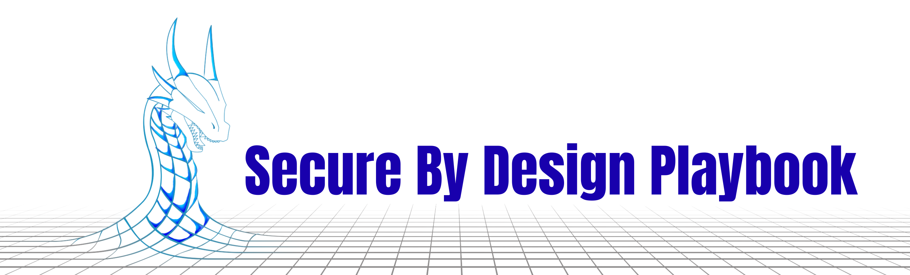

  
  

This is a guide, with supporting material, to help you **assess security risks** for your small to medium size IT project.  It is intended for both technical and **non-technical staff**, at least during the early iterations, to help you **understand the interplay of risk costs and benefits**. 

In particular this playbook will help you follow the UK government's [Secure By Design](https://www.security.gov.uk/policy-and-guidance/secure-by-design/) approach. It implements [NIST's Cyber Security Framework](https://www.nist.gov/cyberframework) and [Risk Management Framework](https://csrc.nist.gov/projects/risk-management/about-rmf) which are widely recognised and will be familiar to your cyber security advisors and auditors.  Ready-made templates provided here match these standard frameworks, but you can use others. 

The approach given here will show you how to rigorously approach security, with the right artefacts to engage with your security experts and auditors, for your situation. In common situations you could and should use ready-made checklists (such as [NCSC's Cyber Essentials](https://www.ncsc.gov.uk/cyberessentials/)) that list standard defenses to install. While these can be quick, easy to use, and useful, in unusual systems and circumstances such checklists can cause more harm than good.   

This playbook is auto-published to the [Secure By Design School pages](https://securebydesignschool.github.io/SecureByDesign-Playbook/Playbook.md), and is maintained on github at the [Secure By Design Playbook repository](https://github.com/SecureByDesignSchool/SecureByDesign-Playbook/) 

## Start

Want to just get started? Go straight to the [Playbook](Playbook.md)

[Some examples here](./examples/) 

## Background 

[Why SbD?](about/WhySbD.md)  Security is already designed into most systems; why do we need a concept called 'Secure By Design'? 

[Why this playbook?](about/WhyPlaybook.md)  What does this give you on top of the existing cyber security frameworks?

## Managing your Assessment 

[Spirals not Cycles: Managing your assessments](./manage/SpiralNotCycle.md): Iterate - do it quickly and then again slowly, and then again at whatever detail you need. 

[Security Terms and Concepts](./explain/TermsAndConcepts.md):  The process is outlined here with the terms used in the playbook, along with some other commonly used ones so you can see how they relate. 

### Who do you need?

In principle you don't need to be technical to run the first iteration - and it may even be more useful not to be. However you will need someone who understands the 'space' that you are protecting: where your assets are located, which routes they are moved down or accessed through, where the boundaries are and what the connections are between the space you are protecting and the areas around it.

You should also have someone knowledgeable who can check your assessments, both to help assure *you* that you are doing the right thing (or correct you if you are not in some places) and also to assure your *customers* that what you are delivering is *suitably* secure.

### What do you need?

After the initial iterations, you will need some ways of exploring your networks so that you know what is actually stored where, and the connections and routes between locations. 

For the risk assessment itself you can start with some spreadsheets which will be sufficient, and we provide some templates and examples. However as you dig deeper you will find the combinations of assets, effects, places, routes, and threats can become unwieldy. At this point we would recommend a suitable database, which will depend on what is available to you. 

## Adding to this Project

Help us improve: what terms here do you find alien, what would you use? What analogies or stories might you bring to help explain some concepts?

[How to contribute](special/Contribute.md)

## Related

See [About](./about/Readme.md) for links to related approaches and references

